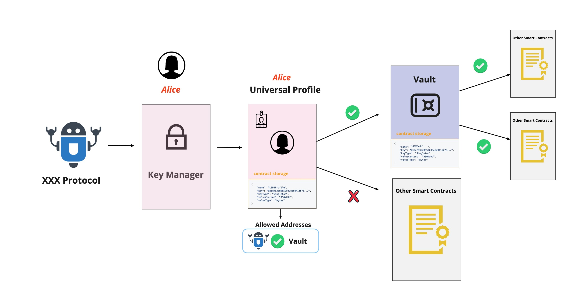

# Restrict Addresses to Vaults

As mentioned previously, the **Vault** can be used to restrict different addresses (protocols, other devices, etc..) to execute and set Data on it instead of setting and executing directly on the Universal Profile. 

In this way, when **granting a third party permissions** to execute through your profile, this third party will only be able to interact with the Vault and all the other assets will be safe.



## Granting Permission to 3rd Parties

:::note

Make sure to not grant the 3rd party address the **SUPER Permissions**, otherwise the **AllowedAddresses restriction** will not work.

:::

Check the guide of **[granting permissions to 3rd Parties](../key-manager/give-permissions.md)**, and make sure to grant the 3rd party address the **CALL Permission**.

## Use AllowedAddresses permission for the 3rd Parties

In this step, after granting the 3rd party the permission **CALL**, we will need to **restrict the address of the 3rd party** to only interact with the **Vault address**. We will be using the [AllowedAddresses permission](../../standards/universal-profile/lsp6-key-manager.md#allowed-addresses) from the Key Manager.

```typescript title="Setting Allowed Addresses for the 3rd party address"
import constants from "@lukso/lsp-smart-contracts/constants.js";

const myVaultAddress = "0x.." // address of the Vault
const thirdPartyAddress = '0x..' // address of the third party you want to restrict

const allowedAddressesDataKey = // constructing the data key of allowed addresses 
  constants.ERC725YKeys.LSP6["AddressPermissions:AllowedAddresses"] + 
  thirdPartyAddress.substring(2);  // of the 3rd party

// the data value holding the addresses that the 3rd party is allowed to interact with
const arrayOfAddresses = web3.eth.abi.encodeParameter("address[]", [myVaultAddress]);

// encode setData payload on the UP
const setDataPayload = await myUP.methods[
    "setData(bytes32,bytes)"
  ](allowedAddressesDataKey, arrayOfAddresses).encodeABI();

// getting the Key Manager address from UP
const myKeyManagerAddress = await myUP.methods.owner().call()

// create an instance of the KeyManager
let myKM = new web3.eth.Contract(LSP6KeyManager.abi, myKeyManagerAddress);

// execute the setDataPayload on the KM
await myKM.methods.execute(setDataPayload).send({
    from: myEOA.address,
    gasLimit: 600_000,
    });
```