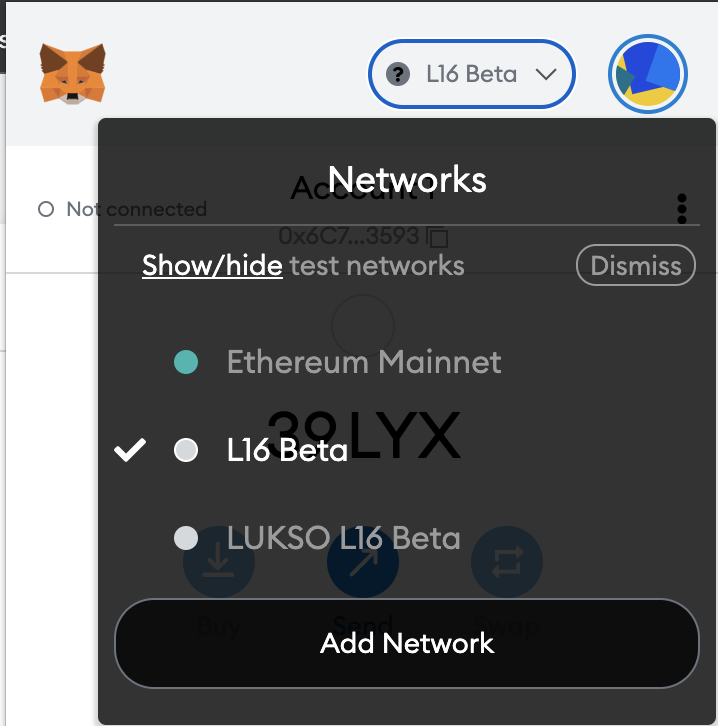
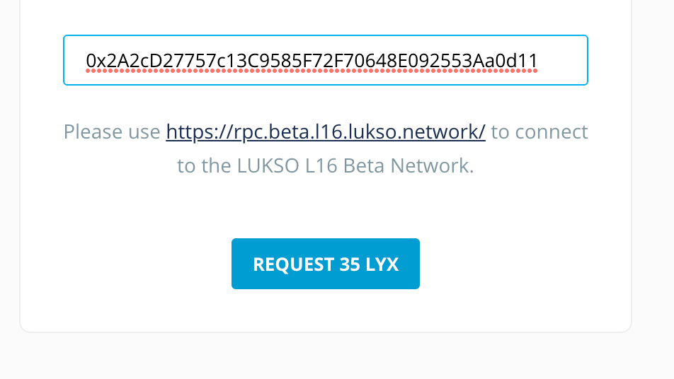
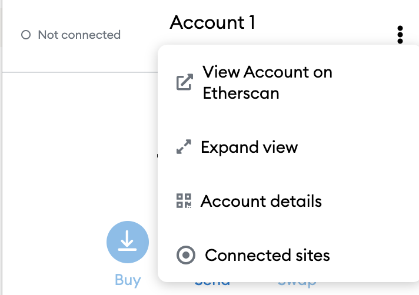
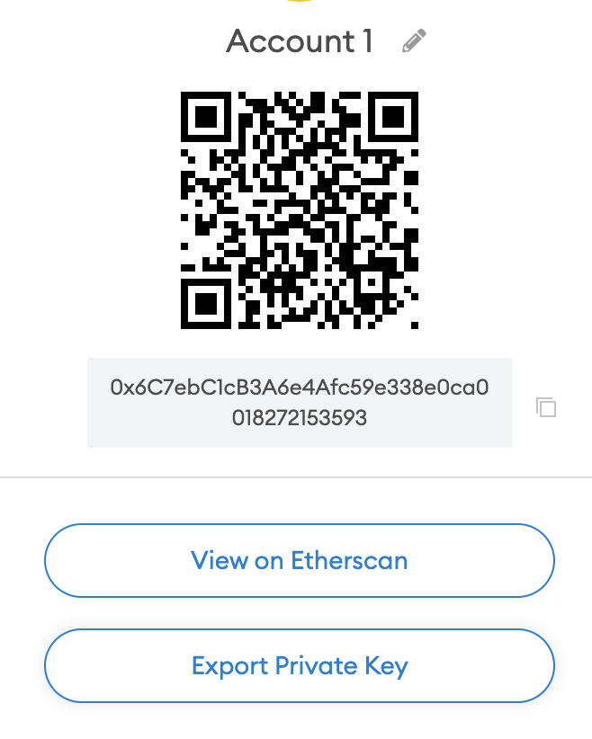

# L16 Public Testnet

| Setting                      | Value                                                                                                                                                                     |
| ---------------------------- | ------------------------------------------------------------------------------------------------------------------------------------------------------------------------- |
| Network Name                 | L16 Beta                                                                                                                                                                  |
| New RPC URL                  | https://rpc.beta.l16.lukso.network                                                                                                                                        |
| Chain ID                     | 19051978 (0x122B5CA)                                                                                                                                                      |
| Currency Symbol              | LYXt                                                                                                                                                                      |
| Execution Block Explorer URL | [https://ethstats.l16.d.lukso.dev](https://ethstats.l16.d.lukso.dev) |
| Consensus Block Explorer URL | [https://consensus.stats.beta.l16.lukso.network](https://consensus.stats.beta.l16.lukso.network)                                                                          |

## Running the nodes

### Installing dependencies

Prepare your environment. You need:

1. Docker ([How to install docker](https://docs.docker.com/get-docker/))
2. [Docker Compose](https://docs.docker.com/compose/)
3. [curl](https://macappstore.org/curl/)
4. wget (linux users only)
5. Make
6. [jq](https://stedolan.github.io/jq/)

```bash title="Example script for installing docker"
# install dependencies
sudo apt-get -y update
sudo apt-get -y install make curl wget jq

# install docker
curl -fsSL https://get.docker.com -o get-docker.sh
sudo sh get-docker.sh

# install docker-compose
sudo curl -L "https://github.com/docker/compose/releases/download/1.29.2/docker-compose-$(uname -s)-$(uname -m)" -o /usr/local/bin/docker-compose
sudo chmod +x /usr/local/bin/docker-compose
sudo ln -s /usr/local/bin/docker-compose /usr/bin/docker-compose
docker-compose --version
```

### Installing the nodes

```bash
mkdir lukso-l16-testnet && cd lukso-l16-testnet
curl https://raw.githubusercontent.com/lukso-network/network-configs/l16-dev/l16/network_setup_kit/install.sh | bash
```

This will download `docker-compose.yaml`, `Makefile`, `configs` and `.env` files.

### Starting the nodes

```bash
# Start your nodes
make start

# You can check logs with
make log_execution
make log_consensus

# Stop your nodes
make stop

# If your nodes are stopped, you could reset them using
# Reset clears the database, which forces your node to sync again on start
make reset
```

### Check the network status

You can see you node in the following page:

1. [https://execution.stats.beta.l16.lukso.network](https://execution.stats.beta.l16.lukso.network) or [https://ethstats.l16.d.lukso.dev/](https://ethstats.l16.d.lukso.dev/)
2. [https://consensus.stats.beta.l16.lukso.network](https://consensus.stats.beta.l16.lukso.network)

## How to become A Validator

### Request some test tokens: LYXt

Make sure to install [MetaMask](https://metamask.io/).

To add the L16 Beta Network to [MetaMask](https://metamask.io/) you can follow this tutorial: [https://blog.suhailkakar.com/add-custom-networks-to-metamask](https://blog.suhailkakar.com/add-custom-networks-to-metamask)

**Use the following parameters:**

| Setting            | Value                                                                                                 |
| ------------------ | ----------------------------------------------------------------------------------------------------- |
| Network Name       | L16 Beta                                                                                              |
| New RPC URL        | [https://rpc.beta.l16.lukso.network](https://rpc.beta.l16.lukso.network)                              |
| Chain ID           | 19051978 (0x122B5CA)                                                                                  |
| Currency Symbol    | LYXt                                                                                                  |
| Block Explorer URL | [http://execution.explorer.beta.l16.lukso.network](http://execution.explorer.beta.l16.lukso.network/) |

Then select `L16 Beta` from the dropdown



Copy address to the clipboard using the box icon


Go to [https://faucet.beta.l16.lukso.network](https://faucet.beta.l16.lukso.network)

Paste the copied address to the box and press “Request 35 LYX”



Wait for 1 minute and check balance in your MetaMask. You should have received 35 LYX.

### Create Wallet and Deposit data

First generate a validator mnemonic seed phrase. **This mnemonic seed generates your validator private key, store it in a safe location.**

You will need this mnemonic to create your validator address and deposit data. If you want to generate a separate withdrawal mnemonic then generate another mnemonic using the same command and copy both of the mnemonics in a safe place.

```bash
make mnemonic
```

Generate a wallet using the following command. It will ask for the number of validators, validator-mnemonic (generated using above command) and a keystore password.

```bash
make create-wallet

# a directory named keystore will be created
```

Generate a `deposit-data.json` using the following command. It will ask for the number of validators, validator mnemonic and withdrawal mnemonic.

```bash
make create-deposit
```

You will find `deposit-data.json` file inside your current directory.

### Submitting your deposit transaction

#### Get your address and private key from MetaMask

Open MetaMask and click on the 3 dot menu on the right side and select `Account details`



Click on Export Private Key and copy it into the clipboard



#### Update secrects.env and submit transactions

Update `secrets.env` using the public address and private key from MetaMask

```bash
ETH1_FROM_ADDR=YOUR_PUBLIC_KEY
ETH1_FROM_PRIV=YOUR_PRIVATE_KEY
```

Submit transactions, this will send the transaction.

```bash
# submit deposit
make submit-deposit

# wait 8h till validator is activated
```

You will need to wait for 8 hours to activate your validator

### Run the validator client

Once your validator is activated you spin up a validator client. **Make sure your _consensus_ and _execution_ clients are running (running `make start`).**

```bash
make start-validator

# You can check logs with
make log_validator

# You can stop the validator using, this will also stop all other nodes
make stop
```
