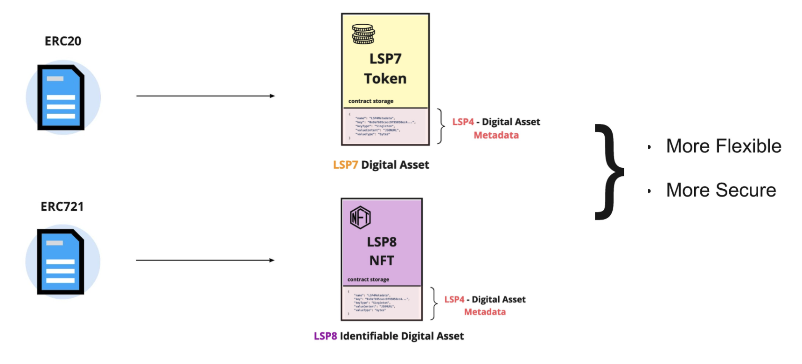

# Tokens & NFT 2.0

:::success Useful Tip

The [Guides Section](../../guides/assets/create-lsp7-digital-asset.md) will walk you through creating and deploying an LSP7 token or an LSP8 NFT on the [L14 test network](../../networks/l14-testnet.md).
Check also the [universalprofile.cloud](https://universalprofile.cloud/) website to easily browse the deployed digital assets.

:::

:::info

The [_`@lukso/lsp-smart-contracts`_](https://github.com/lukso-network/lsp-smart-contracts) repository on GitHub contains [implementations of LSP7 and LSP8 that are backwards compatible with ERC20 and ERC721](https://github.com/lukso-network/lsp-universalprofile-smart-contracts/tree/main/contracts). But it is highly recommended to use the native ones.

:::

**Tokens & NFT 2.0** is a collective name for the new token and NFT standards [LSP7-DigitalAsset](https://github.com/lukso-network/LIPs/blob/main/LSPs/LSP-7-DigitalAsset.md) and [LSP8-IdentifiableDigitalAsset](https://github.com/lukso-network/LIPs/blob/main/LSPs/LSP-8-IdentifiableDigitalAsset.md). These replace ERC20 and ERC721, which you would usually use on Ethereum.

>

The interfaces used to interact with these standards are inspired by [EIP1155](https://eips.ethereum.org/EIPS/eip-1155), a Multi-Token standard for multiple token types (fungible, non-fungible, or other configurations).

One of the main questions about NFT 2.0 is which characteristics make them the next generation of digital assets on the blockchain.

**How different are they compared to traditional ERC20 tokens / ERC721 NFTs?**

## How Tokens & NFT 2.0 are different?

### Unlimited Metadata

:::info

See the [LSP4 - Digital Asset Metadata standard](./02-LSP4-Digital-Asset-Metadata.md) for more information.

:::

The existing tokens and NFTs standards do not offer a standard way to attach information to the contracts themselves. Such information (= metadata) is crucial to make each token / NFT as descriptive and customized as possible.

Consider the current ERC20 / ERC721 as an example. These standards only define a `name`, `symbol` and `tokenURI`. But how about if we would like to attach more specific data to the asset? (_e.g.: icon, asset creator(s), token utility or motive, community behind it_).

The **Tokens and NFT 2.0 Standards** solve this problem by using [ERC725Y](https://github.com/ERC725Alliance/ERC725/blob/main/docs/ERC-725.md#erc725y) as a backbone. ERC725Y enables smart contracts to have a very flexible and extensible storage. With ERC725Y, any information or metadata can be attached to the token or NFT.

### Safer transfers

Tokens and NFT 2.0 introduce a **new `force` parameter** (_default_: FALSE). The intention behind it is to prevent transfers that can result in assets being lost forever. Examples are:

- _accidental transfers_: due to input mistakes (_eg: pasting the wrong recipient address, or making a typo in the recipient address_)
- _unsafe transfers_: to unwanted or untrusted addresses.

In the LUKSO ecosystem, the `force` parameter restricts transfer to Externally Owned Accounts (EOA) or contracts that do not implement the [LSP1 - Universal Receiver](../generic-standards/02-lsp1-universal-receiver.md) standard. The reason behind it is that contracts not implementing the [`universalReceiver(...)`](../../standards/smart-contracts/lsp0-erc725-account.md#universalreceiver) functionality might not be able to register or transfer these assets after receiving them.

## References

- [NFT NYC - Building Blocks for the New Creative Economy (Fabian Vogelsteller, Youtube)](https://www.youtube.com/watch?v=skA4Y-vvt5s&t=2s)
