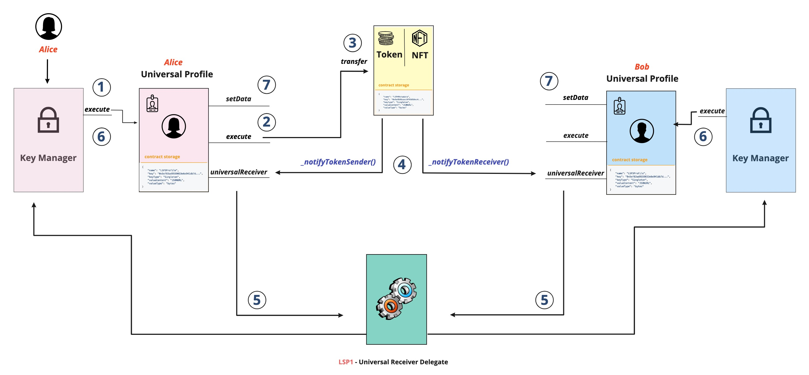

# LSP5 - Received Assets

:::info Standard Document

[LSP5 - Received Assets](https://github.com/lukso-network/LIPs/blob/main/LSPs/LSP-5-ReceivedAssets.md)

:::

## Introduction

Keeping track of all the tokens that an address owns is currently unfeasible. If you want to know from which tokens you own, you need to manually import the token contract address and query the balance of your key in it each time for each token. This brings light to the following problem: owning tokens without being aware because there are no ways of being notified about the tokens you have received in the first place.

One way to solve this problem is to create generic metadata keys that would register in the smart contract storage a) how many different tokens you own and b) the address of the transferred token contracts.

## What does this standard represent ?

:::success Recommendation

It is advised to check the **`LSP5ReceivedAssets[]`** key to check if a contract supports the **LSP5 - ReceivedAsset** standard.

:::

This Metadata standard describes two keys that can be added to an [ERC725Y](https://github.com/ethereum/EIPs/blob/master/EIPS/eip-725.md#erc725y) smart contract to reference and keep track of received assets.

### LSP5ReceivedAssets[]

This key represents a list of all tokens and NFTs currently owned by the contract.

```json
{
  "name": "LSP5ReceivedAssets[]",
  "key": "0x6460ee3c0aac563ccbf76d6e1d07bada78e3a9514e6382b736ed3f478ab7b90b",
  "keyType": "Array",
  "valueType": "address",
  "valueContent": "Address"
}
```

### LSP5ReceivedAssetsMap

This key represents a map key holding:

- the index in the [`LSP5ReceivedAssets[]`](#lsp5receivedassets-) Array where the received asset addresses are stored.
- an [ERC165 interface ID](https://eips.ethereum.org/EIPS/eip-165) to easily identify the standard used by each asset smart contract (without the need to query the asset contracts directly).

The `LSP5ReceivedAssetsMap` key also helps to prevent adding duplications to the Array, when automatically added via smart contract (e.g. a [LSP1-UniversalReceiverDelegate](./02-lsp1-universal-receiver-delegate.md)).

```json
{
  "name": "LSP5ReceivedAssetsMap:<address>",
  "key": "0x812c4334633eb81600000000<address>",
  "keyType": "Mapping",
  "valueType": "bytes",
  "valueContent": "Mixed"
}
```

### Flow

:::info Note

The keys are also set on the **sender Universal Profile** to remove the token contract address if all the balance is sent.

:::

These keys are automatically updated in the Universal Profile storage via the [LSP1UniversalReceiverDelegateUP](../smart-contracts/lsp1-universal-receiver-delegate-up.md) contract if set, when transferring tokens.
Check [Token transfer scenario](./lsp1-universal-receiver-delegate#token-transfer-scenario).




